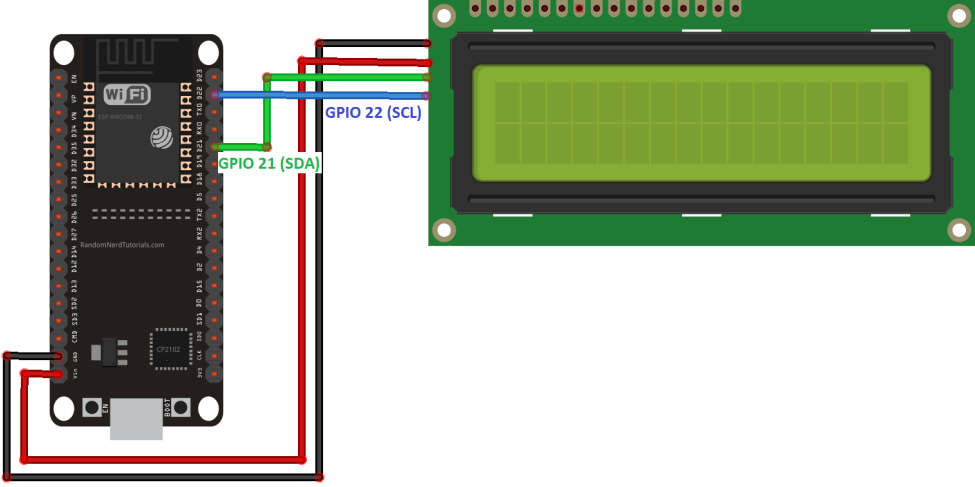
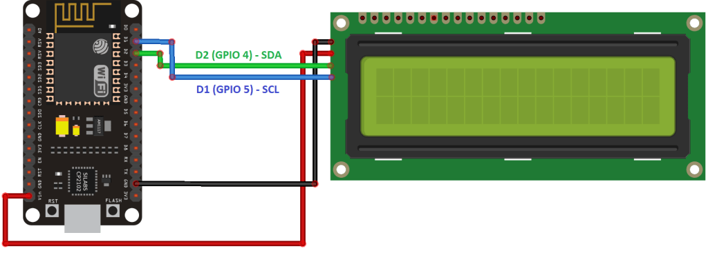

# ESP8266_NovelCovidAPI_Display
Display to show covid19 cases in realtime

# Parts Required
* ESP8266 (NodeMCU) or ESP32
* LCD16x2 With I2C Interface
* Female to female jumper wires

In my case I'm using ESP8266 (NodeMCU)

# Libraries
* Arduino_JSON (Official) `you can download from Arduino IDE`
* [LiquidCrystal_I2C](https://github.com/marcoschwartz/LiquidCrystal_I2C)

# Connection Schemes
## Wiring the LCD to the ESP32
Wire your LCD to the ESP32 by following the next schematic diagram. We’re using the ESP32 default I2C pins (GPIO 21 and GPIO 22).

    

You can also use the following table as a reference.
| LCD (16x2) I2C | ESP8266 |
|:---------------|:--------| 
GND	| <i style="background:#333; border-radius:3px; padding:5px;">GND</i>
VCC	| <i style="background:#cc3333; border-radius:3px; padding:5px;">VIN</i>
SDA | <i style="background:#009900; border-radius:3px; padding:5px;">GPIO 21</i>
SCL | <i style="background:#0066cc; border-radius:3px; padding:5px;">GPIO 22</i>
 
 

## Wiring the LCD to the ESP8266
You can also wire your LCD to the ESP8266 by following the next schematic diagram. We’re using the ESP8266 default I2C pins (GPIO 4 and GPIO 5).

    

You can also use the following table as a reference.
| LCD (16x2) I2C | ESP8266 |
|:---------------|:--------| 
GND	| <i style="background:#333; border-radius:3px; padding:5px;">GND</i>
VCC	| <i style="background:#cc3333; border-radius:3px; padding:5px;">VIN</i>
SDA | <i style="background:#009900; border-radius:3px; padding:5px;">GPIO 4</i> (D2)
SCL | <i style="background:#0066cc; border-radius:3px; padding:5px;">GPIO 5</i> (D1)